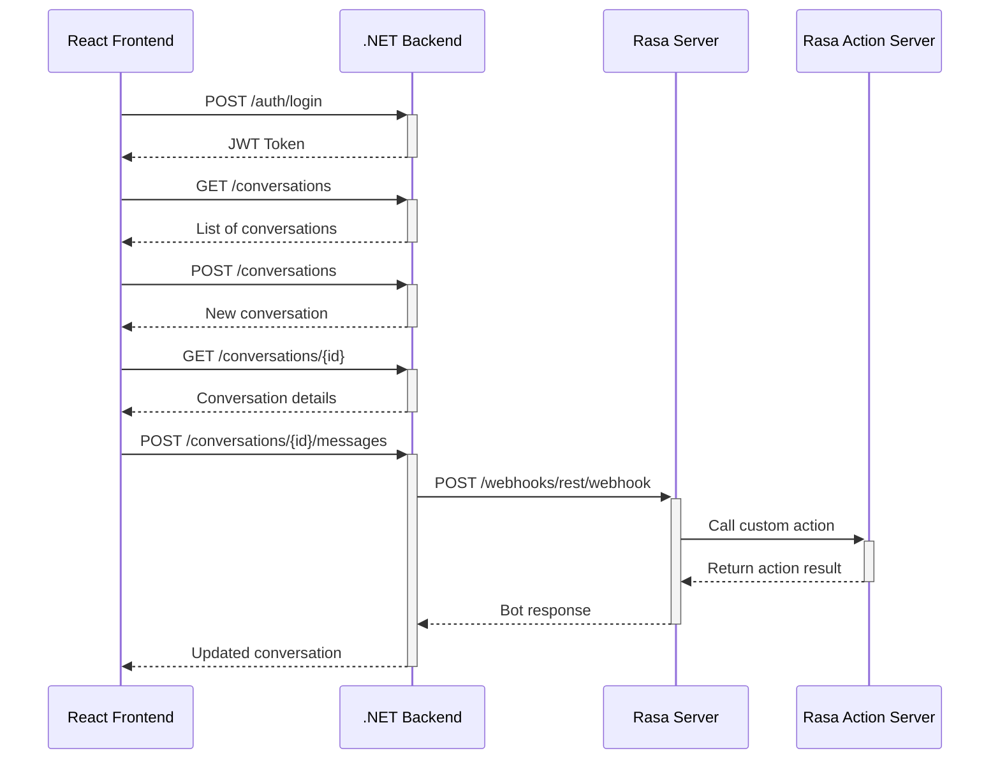

```mermaid
sequenceDiagram
    participant ReactFrontend as React Frontend
    participant DotNetBackend as .NET Backend
    participant RasaServer as Rasa Server
    participant RasaActionServer as Rasa Action Server

    ReactFrontend->>+DotNetBackend: POST /auth/login
    DotNetBackend-->>-ReactFrontend: JWT Token

    ReactFrontend->>+DotNetBackend: GET /conversations
    DotNetBackend-->>-ReactFrontend: List of conversations

    ReactFrontend->>+DotNetBackend: POST /conversations
    DotNetBackend-->>-ReactFrontend: New conversation

    ReactFrontend->>+DotNetBackend: GET /conversations/{id}
    DotNetBackend-->>-ReactFrontend: Conversation details

    ReactFrontend->>+DotNetBackend: POST /conversations/{id}/messages
    DotNetBackend->>+RasaServer: POST /webhooks/rest/webhook
    RasaServer->>+RasaActionServer: Call custom action
    RasaActionServer-->>-RasaServer: Return action result
    RasaServer-->>-DotNetBackend: Bot response
    DotNetBackend-->>-ReactFrontend: Updated conversation
```
